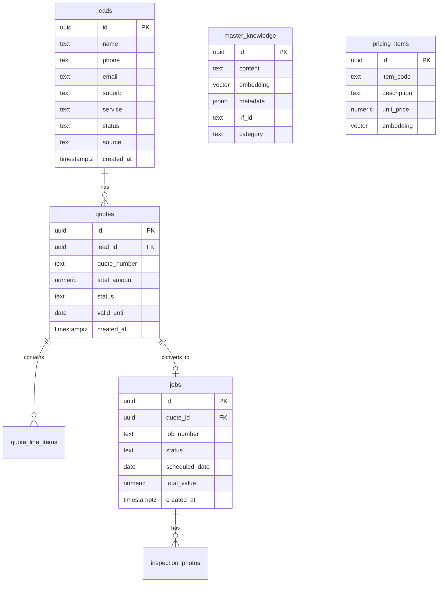

# CKR Digital Engine - Database Schema Documentation

**Generated:** 2025-11-12  
**Database:** Supabase PostgreSQL 15  
**Total Tables:** 60+  
**Active Tables:** 28

---

## Core Business Tables

### `leads` - Customer Inquiry Management

**Purpose:** Central table for managing incoming customer inquiries from all sources (web forms, phone calls, referrals).

**Business Context:**
- Represents the top of the sales funnel
- Average conversion rate: 30% lead → quote
- Retention: Keep for 2 years, then archive

#### Schema

| Column | Type | Nullable | Default | Description |
|--------|------|----------|---------|-------------|
| id | uuid | NO | gen_random_uuid() | Primary key |
| name | text | NO | - | Customer full name |
| phone | text | NO | - | Australian mobile format: 04XX XXX XXX |
| email | text | YES | - | Optional email for follow-up |
| suburb | text | NO | - | SE Melbourne suburb name |
| service | text | NO | - | Requested service type |
| status | text | NO | 'new' | Pipeline stage: new, contacted, quoted, won, lost |
| source | text | NO | - | Lead origin: homepage_hero_form, google_ads, referral |
| urgency | text | YES | - | low, medium, high, emergency |
| message | text | YES | - | Additional customer notes |
| created_at | timestamptz | NO | now() | Auto-populated on insert |
| updated_at | timestamptz | NO | now() | Auto-updated via trigger |

#### Relationships
- **One-to-Many**: `leads.id` → `quotes.lead_id` (one lead can have multiple quotes)
- **One-to-Many**: `leads.id` → `lead_notes.lead_id` (conversation history)
- **One-to-Many**: `leads.id` → `lead_tasks.lead_id` (follow-up tasks)

#### RLS Policies
```sql
-- SELECT: Inspectors and admins only
CREATE POLICY "Inspectors and admins can view leads"
ON leads FOR SELECT TO authenticated
USING (is_inspector(auth.uid()) OR is_admin_user(auth.uid()));

-- INSERT: Service role only (via edge functions)
CREATE POLICY "Service role can insert leads"
ON leads FOR INSERT TO service_role
WITH CHECK (true);

-- UPDATE: Inspectors and admins only
CREATE POLICY "Inspectors and admins can update leads"
ON leads FOR UPDATE TO authenticated
USING (is_inspector(auth.uid()) OR is_admin_user(auth.uid()));
```

#### Usage Examples
```sql
-- Find all hot leads from this week
SELECT * FROM leads 
WHERE status = 'new' 
  AND created_at > NOW() - INTERVAL '7 days'
  AND urgency IN ('high', 'emergency')
ORDER BY created_at DESC;

-- Lead conversion funnel analysis
SELECT 
  status,
  COUNT(*) as count,
  ROUND(COUNT(*) * 100.0 / SUM(COUNT(*)) OVER (), 2) as percentage
FROM leads
WHERE created_at > NOW() - INTERVAL '30 days'
GROUP BY status;
```

---

### `quotes` - Quote Generation & Tracking

**Purpose:** Store detailed quote information including line items, pricing calculations, and approval status.

**Business Context:**
- Quotes valid for 30 days
- Average quote value: $3,500 - $8,000
- Conversion rate: 65% quote → job

#### Schema

| Column | Type | Nullable | Description |
|--------|------|----------|-------------|
| id | uuid | NO | Primary key |
| lead_id | uuid | YES | Foreign key to leads table |
| quote_number | text | NO | Format: QTE-YYYYMMDD-XXX |
| customer_name | text | NO | Customer name (denormalized) |
| customer_email | text | YES | Customer email |
| customer_phone | text | NO | Customer phone |
| property_address | text | NO | Full property address |
| suburb | text | NO | Property suburb |
| roof_type | text | NO | Tile, metal, or colorbond |
| roof_condition | text | YES | Current condition assessment |
| service_type | text | NO | Primary service requested |
| total_amount | numeric(10,2) | NO | Total quote amount (including GST) |
| gst_amount | numeric(10,2) | NO | GST component |
| subtotal | numeric(10,2) | NO | Pre-GST amount |
| discount_amount | numeric(10,2) | YES | Applied discount |
| status | text | NO | draft, sent, approved, rejected, expired |
| valid_until | date | NO | Expiry date (30 days from creation) |
| notes | text | YES | Internal notes |
| created_at | timestamptz | NO | Auto-populated |
| updated_at | timestamptz | NO | Auto-updated via trigger |

#### Relationships
- **Many-to-One**: `quotes.lead_id` → `leads.id`
- **One-to-Many**: `quotes.id` → `quote_line_items.quote_id`
- **One-to-Many**: `quotes.id` → `jobs.quote_id` (when quote converts to job)

#### RLS Policies
```sql
-- SELECT: Inspectors and admins only
CREATE POLICY "Inspectors and admins can view quotes"
ON quotes FOR SELECT TO authenticated
USING (is_inspector(auth.uid()) OR is_admin_user(auth.uid()));

-- INSERT/UPDATE: Inspectors and admins only
CREATE POLICY "Inspectors and admins can manage quotes"
ON quotes FOR ALL TO authenticated
USING (is_inspector(auth.uid()) OR is_admin_user(auth.uid()));
```

---

### `jobs` - Job Execution & Project Management

**Purpose:** Track active roofing projects from quote approval to completion.

**Business Context:**
- Average job duration: 2-5 days
- Payment terms: 30% deposit, 70% on completion
- Warranty period: 10-20 years (stored in `jobs.warranty_years`)

#### Schema

| Column | Type | Nullable | Description |
|--------|------|----------|-------------|
| id | uuid | NO | Primary key |
| quote_id | uuid | YES | Foreign key to quotes table |
| job_number | text | NO | Format: JOB-YYYYMMDD-XXX |
| customer_name | text | NO | Customer name |
| property_address | text | NO | Job site address |
| suburb | text | NO | Job suburb |
| service_type | text | NO | Service being performed |
| status | text | NO | scheduled, in_progress, completed, cancelled |
| scheduled_date | date | YES | Planned start date |
| completion_date | date | YES | Actual completion date |
| assigned_crew | text | YES | Crew leader name |
| total_value | numeric(10,2) | NO | Total job value |
| deposit_paid | boolean | NO | Deposit payment received |
| final_payment_received | boolean | NO | Final payment received |
| warranty_years | integer | YES | Warranty period (10, 15, or 20 years) |
| notes | text | YES | Job notes and updates |
| created_at | timestamptz | NO | Auto-populated |
| updated_at | timestamptz | NO | Auto-updated via trigger |

#### Relationships
- **Many-to-One**: `jobs.quote_id` → `quotes.id`
- **One-to-Many**: `jobs.id` → `inspection_photos.job_id` (before/after photos)

#### RLS Policies
```sql
-- SELECT: Inspectors and admins only (CRITICAL: Fixed from USING (true))
CREATE POLICY "Inspectors and admins can view jobs"
ON jobs FOR SELECT TO authenticated
USING (is_inspector(auth.uid()) OR is_admin_user(auth.uid()));

-- INSERT/UPDATE/DELETE: Inspectors and admins only
CREATE POLICY "Inspectors and admins can manage jobs"
ON jobs FOR ALL TO authenticated
USING (is_inspector(auth.uid()) OR is_admin_user(auth.uid()));
```

---

## Knowledge & RAG System Tables

### `master_knowledge` - RAG Vector Store

**Purpose:** Central knowledge base for RAG-powered AI assistance, storing all CKR operational knowledge with embeddings.

**Business Context:**
- Contains 96 knowledge records
- Sources: KF_00 through KF_11 (Knowledge Files), GWA workflows, brand guidelines
- Updated via `rag-indexer` edge function

#### Schema

| Column | Type | Nullable | Description |
|--------|------|----------|-------------|
| id | uuid | NO | Primary key |
| content | text | NO | Knowledge chunk text (1200 chars) |
| embedding | vector(1536) | YES | OpenAI text-embedding-3-small embedding |
| metadata | jsonb | YES | Source file, category, version, tags |
| source_file | text | YES | Original filename (e.g., "KF_02_PRICING_MODEL.json") |
| category | text | YES | brand, pricing, sop, gwa, marketing |
| kf_id | text | YES | Knowledge File ID (e.g., "KF_02") |
| section | text | YES | Section within KF file |
| priority | integer | YES | Search priority weight (1-10) |
| created_at | timestamptz | NO | Auto-populated |
| updated_at | timestamptz | NO | Auto-updated via trigger |

#### Indexes
```sql
-- Vector similarity search index
CREATE INDEX master_knowledge_embedding_idx ON master_knowledge 
USING ivfflat (embedding vector_cosine_ops) WITH (lists = 100);

-- Metadata search indexes
CREATE INDEX master_knowledge_category_idx ON master_knowledge (category);
CREATE INDEX master_knowledge_kf_id_idx ON master_knowledge (kf_id);
CREATE INDEX master_knowledge_source_file_idx ON master_knowledge (source_file);
```

#### Usage Examples
```sql
-- RAG search for pricing information
SELECT 
  id,
  content,
  metadata,
  1 - (embedding <=> query_embedding) as similarity
FROM master_knowledge
WHERE category = 'pricing'
ORDER BY embedding <=> query_embedding
LIMIT 5;

-- Count knowledge chunks by Knowledge File
SELECT 
  kf_id,
  COUNT(*) as chunk_count,
  AVG(LENGTH(content)) as avg_chunk_length
FROM master_knowledge
WHERE kf_id IS NOT NULL
GROUP BY kf_id
ORDER BY kf_id;
```

---

### `pricing_items` - Vectorized Pricing Database

**Purpose:** Store roofing pricing data with embeddings for semantic search during quote generation.

#### Schema

| Column | Type | Nullable | Description |
|--------|------|----------|-------------|
| id | uuid | NO | Primary key |
| item_code | text | NO | Unique item identifier |
| description | text | NO | Item description |
| category | text | NO | labour, materials, equipment |
| unit | text | NO | sqm, linear_metre, hour, item |
| unit_price | numeric(10,2) | NO | Base price per unit |
| gst_inclusive | boolean | NO | Whether price includes GST |
| embedding | vector(1536) | YES | Semantic search embedding |
| metadata | jsonb | YES | Additional pricing context |
| is_active | boolean | NO | Active pricing item |
| created_at | timestamptz | NO | Auto-populated |
| updated_at | timestamptz | NO | Auto-updated via trigger |

---

## Content Management Tables

### `content_services` - Service Pages CMS

**Purpose:** Store service page content for public website.

#### Schema

| Column | Type | Nullable | Description |
|--------|------|----------|-------------|
| id | uuid | NO | Primary key |
| notion_id | text | YES | Notion database sync ID |
| title | text | NO | Service name |
| slug | text | NO | URL slug (unique) |
| description | text | YES | Service description |
| content | text | YES | Full page content (markdown) |
| featured | boolean | NO | Show on homepage |
| icon | text | YES | Lucide icon name |
| meta_title | text | YES | SEO title tag |
| meta_description | text | YES | SEO meta description |
| created_at | timestamptz | NO | Auto-populated |
| updated_at | timestamptz | NO | Auto-updated via trigger |

---

## System & Configuration Tables

### `user_roles` - Role-Based Access Control

**Purpose:** Map users to roles for authorization (currently single-user, infrastructure dormant).

#### Schema

| Column | Type | Nullable | Description |
|--------|------|----------|-------------|
| id | uuid | NO | Primary key |
| user_id | uuid | NO | Foreign key to auth.users |
| role | text | NO | admin, inspector, viewer |
| created_at | timestamptz | NO | Auto-populated |

#### RLS Policies
```sql
-- Users can view their own roles
CREATE POLICY "Users can view own roles"
ON user_roles FOR SELECT TO authenticated
USING (user_id = auth.uid());

-- Only admins can manage roles
CREATE POLICY "Admins can manage all roles"
ON user_roles FOR ALL TO authenticated
USING (is_admin_user(auth.uid()));
```

---

## Entity-Relationship Diagram



---

## Migration Strategy

### Current State (2025-11-12)
- **Total migrations:** 45+ applied
- **Last migration:** `20251112142427_fix_jobs_rls_policy.sql`
- **Next cleanup:** `20251112000000_cleanup_unused_tables.sql` (pending review)

### Backup Protocol
1. Always backup before destructive migrations:
   ```bash
   ./scripts/db-backup.sh production pre_migration_backup
   ```
2. Test migrations in development first
3. Keep migration history documented in `docs/database/MIGRATION_HISTORY.md`

---

## Performance Optimization

### Indexes by Table
- **leads**: `created_at`, `status`, `source`
- **quotes**: `quote_number`, `status`, `valid_until`
- **jobs**: `job_number`, `status`, `scheduled_date`
- **master_knowledge**: `embedding` (IVFFlat), `category`, `kf_id`
- **pricing_items**: `item_code`, `category`, `embedding` (IVFFlat)

### Query Optimization Guidelines
1. Always use indexes for WHERE clauses on large tables
2. Use `EXPLAIN ANALYZE` to verify query plans
3. Keep vector similarity searches under 100 rows scanned
4. Use materialized views for complex aggregations

---

*Last updated: 2025-11-12*  
*Maintained by: CKR Digital Engine Team*
