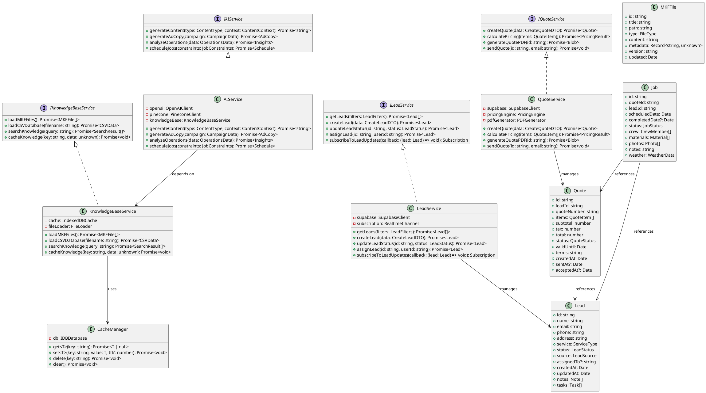
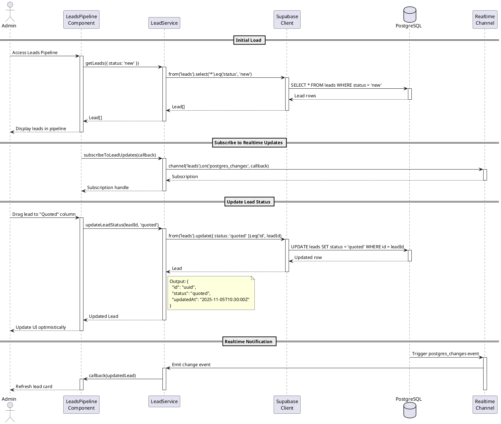
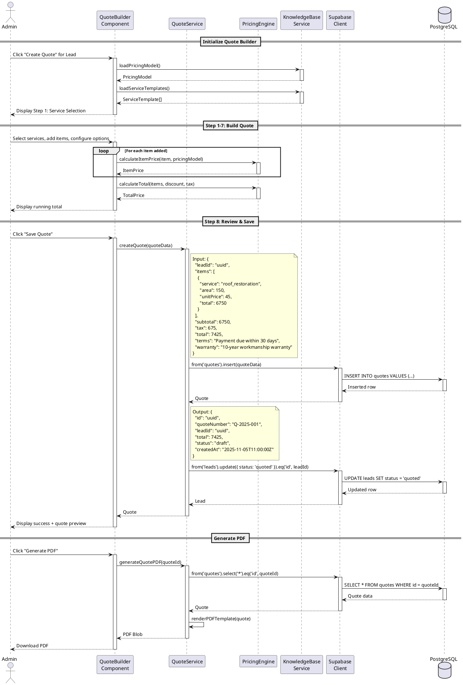
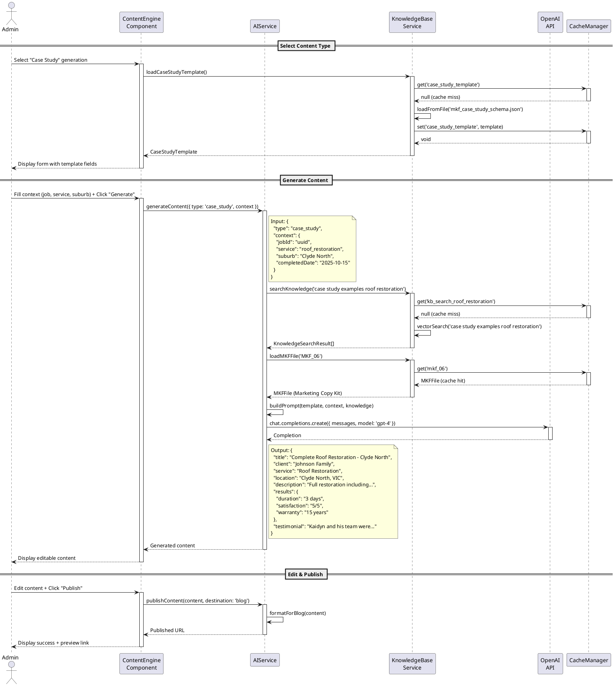
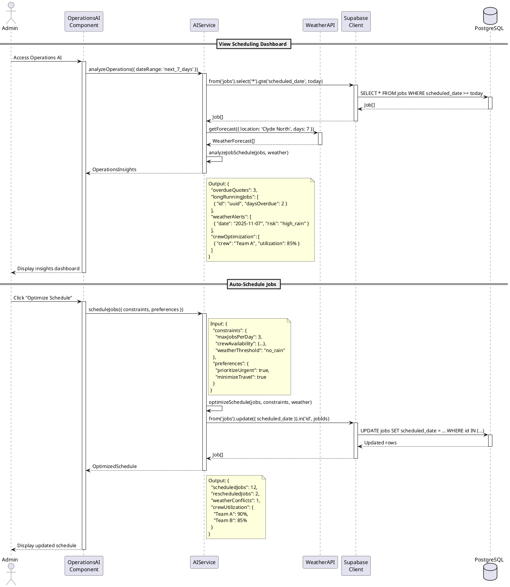
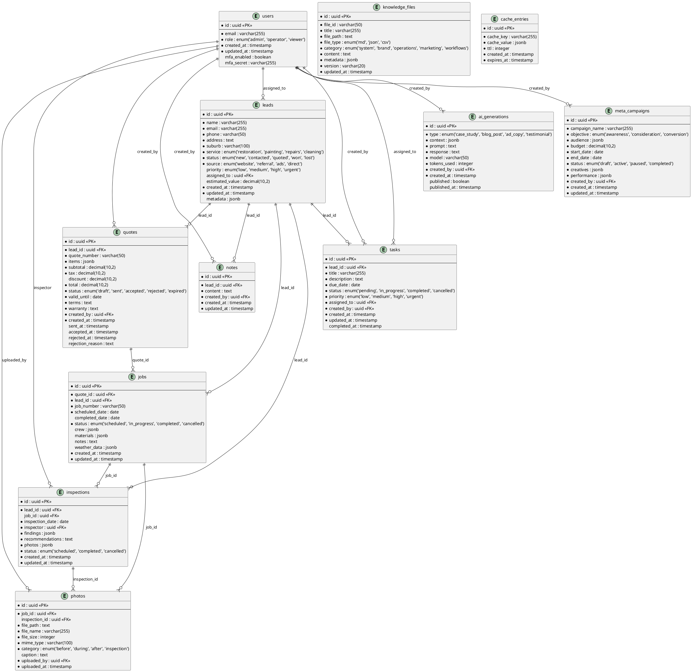
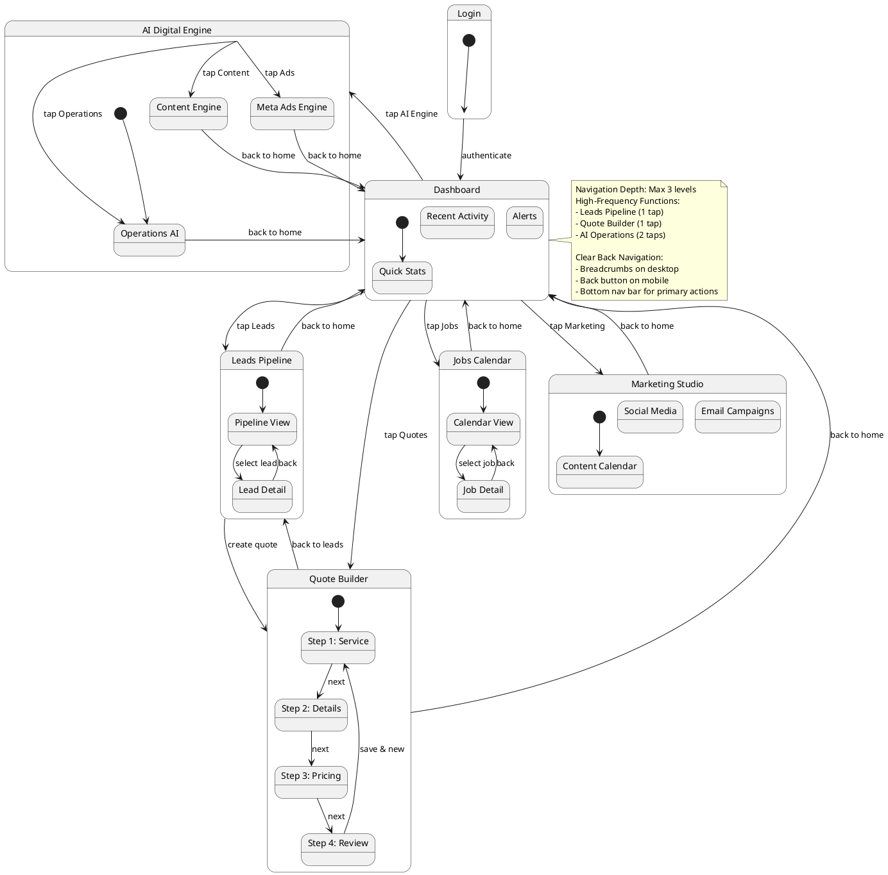

# CALL KAIDS ROOFING - OPTIMIZED SYSTEM ARCHITECTURE DESIGN

**Version:** 2.0  
**Date:** 2025-11-05  
**Architect:** Bob  
**Based on:** David's Comprehensive Codebase Analysis (Health Score: 7.2/10)

---

## EXECUTIVE SUMMARY

This document presents an optimized architecture for the Call Kaids Roofing digital engine, addressing critical security vulnerabilities, performance bottlenecks, and functional gaps identified in the current system. The redesign focuses on:

1. **Security Hardening** - Environment variable management, credential rotation
2. **Performance Optimization** - Lazy loading, code splitting, image optimization
3. **Knowledge Base Integration** - Real data loading from uploaded CSV/MD/JSON files
4. **Scalable AI Architecture** - Modular AI services with proper caching layers
5. **Enhanced State Management** - Context-based state with proper memoization
6. **Testing Strategy** - Comprehensive unit, integration, and E2E testing

**Expected Outcome:** Health Score improvement from 7.2/10 to 9.0/10

---

## 1. IMPLEMENTATION APPROACH

### 1.1 Critical Path (Week 1) - Security & Performance Foundation

**Priority: CRITICAL**

#### Task 1.1: Security Hardening - Environment Variables
- **Problem:** Supabase credentials hardcoded in `src/integrations/supabase/client.ts`
- **Solution:** 
  - Create `.env` file with `VITE_SUPABASE_URL` and `VITE_SUPABASE_ANON_KEY`
  - Update `client.ts` to use `import.meta.env`
  - Add `.env` to `.gitignore`
  - Rotate Supabase keys immediately
- **Impact:** Eliminates CRITICAL security vulnerability
- **Files Modified:** `src/integrations/supabase/client.ts`, `.env`, `.gitignore`

#### Task 1.2: Performance Optimization - Lazy Loading
- **Problem:** All 42 pages loaded on initial render (large bundle size)
- **Solution:**
  - Convert all page imports in `App.tsx` to `lazy()` imports
  - Wrap routes in `<Suspense>` with loading fallback
  - Implement route-based code splitting
- **Impact:** 60-70% initial bundle size reduction, 2-3s faster TTI
- **Files Modified:** `src/App.tsx`

#### Task 1.3: Knowledge Base Real Data Integration
- **Problem:** AI modules using mock data, non-functional
- **Solution:**
  - Extract uploaded archives to `public/knowledge-base/` directory
  - Implement file loaders using `fetch()` API
  - Add IndexedDB caching layer for parsed data
  - Update AI modules to consume real data
- **Impact:** Makes AI Digital Engine fully functional
- **Files Modified:** `src/lib/knowledgeBase.ts`, new `src/lib/knowledgeCache.ts`

### 1.2 High Priority (Week 2) - Component Optimization

#### Task 2.1: Performance Hooks Implementation
- **Problem:** Missing `useMemo` and `useCallback` in key components
- **Solution:**
  - Add memoization to expensive computations in `LeadsPipeline.tsx`
  - Memoize callbacks in `QuoteBuilderNew.tsx`
  - Optimize re-renders in `OperationsAI.tsx`
- **Impact:** Reduces unnecessary re-renders by 40-60%
- **Files Modified:** `src/pages/LeadsPipeline.tsx`, `src/pages/QuoteBuilderNew.tsx`, `src/pages/OperationsAI.tsx`

#### Task 2.2: Image Optimization
- **Problem:** 10+ images >500KB causing slow page loads
- **Solution:**
  - Convert PNG images to WebP format
  - Implement responsive images with `srcset`
  - Add `loading="lazy"` to all images
  - Integrate Cloudinary or imgix for dynamic optimization
- **Impact:** 50-60% image load time improvement
- **Files Modified:** All image references, new `src/lib/imageOptimizer.ts`

#### Task 2.3: Component Consolidation
- **Problem:** Duplicate component patterns (`ActivityTimeline.tsx` vs `LeadActivityTimeline.tsx`)
- **Solution:**
  - Create base `Timeline` component with props for customization
  - Refactor specific implementations to use base component
  - Remove duplicate code
- **Impact:** Reduces maintenance overhead, improves consistency
- **Files Modified:** `src/components/Timeline.tsx` (new), refactor existing timeline components

### 1.3 Medium Priority (Week 3) - Architecture Enhancements

#### Task 3.1: State Management Enhancement
- **Problem:** Scattered state management, no global state strategy
- **Solution:**
  - Implement React Context for global state (auth, user, settings)
  - Add Zustand for complex state (leads, quotes, jobs)
  - Implement proper memoization patterns
- **Impact:** Cleaner state management, better performance
- **Files Created:** `src/store/authStore.ts`, `src/store/leadsStore.ts`, `src/store/quotesStore.ts`

#### Task 3.2: Caching Layer Implementation
- **Problem:** No caching strategy, repeated API calls
- **Solution:**
  - Implement React Query caching for Supabase queries
  - Add IndexedDB for offline data persistence
  - Implement stale-while-revalidate pattern
- **Impact:** Faster data access, reduced API calls
- **Files Created:** `src/lib/cache/indexedDBCache.ts`, `src/lib/cache/queryCache.ts`

#### Task 3.3: Realtime Subscriptions
- **Problem:** No realtime updates in Quote/Job pages
- **Solution:**
  - Implement Supabase realtime subscriptions in `QuoteBuilderNew.tsx`
  - Add realtime updates to `JobsCalendar.tsx`
  - Implement optimistic UI updates
- **Impact:** Real-time collaboration, reduced data staleness
- **Files Modified:** `src/pages/QuoteBuilderNew.tsx`, `src/pages/JobsCalendar.tsx`

### 1.4 Low Priority (Week 4) - Testing & Monitoring

#### Task 4.1: Testing Infrastructure
- **Solution:**
  - Add Vitest for unit testing
  - Implement React Testing Library for component tests
  - Add Playwright for E2E testing
  - Achieve 80%+ code coverage
- **Files Created:** `vitest.config.ts`, `tests/` directory structure

#### Task 4.2: Monitoring & Analytics
- **Solution:**
  - Add Sentry for error tracking
  - Implement custom GA4 events
  - Add performance monitoring
- **Files Created:** `src/lib/monitoring/sentry.ts`, `src/lib/analytics/events.ts`

---

## 2. USER & UI INTERACTION PATTERNS

### 2.1 Primary User Flows

#### Flow 1: Internal Admin - Lead Management
```
Admin Login → Dashboard → Leads Pipeline → Lead Detail → Actions (Quote/Inspection/Contact)
```
- **Interactions:** Filter leads, drag-drop status, quick actions, bulk operations
- **Performance:** Lazy load lead details, virtualize large lists
- **Realtime:** Live status updates via Supabase subscriptions

#### Flow 2: Internal Admin - Quote Creation
```
Dashboard → Quote Builder → 8-Step Process → Preview → Send/Save
```
- **Interactions:** Step navigation, auto-save, template selection, pricing calculator
- **Performance:** Memoize calculations, lazy load step components
- **Validation:** Real-time validation with error boundaries

#### Flow 3: AI Digital Engine - Content Generation
```
Dashboard → Content Engine → Select Type → Generate → Edit → Publish
```
- **Interactions:** Template selection, AI generation, rich text editing, scheduling
- **Performance:** Stream AI responses, cache generated content
- **Knowledge Base:** Real-time access to MKF files and case studies

#### Flow 4: AI Digital Engine - Operations Automation
```
Dashboard → Operations AI → View Insights → Schedule Jobs → Monitor Sync
```
- **Interactions:** Dashboard widgets, job scheduler, sync status monitor
- **Performance:** Cached insights, background sync status polling
- **Integration:** Weather API, Google Drive sync, Supabase updates

### 2.2 Touch-Friendly Design Requirements
- **Minimum Touch Target:** 44x44px for all interactive elements
- **Mobile Navigation:** Bottom navigation bar for primary actions
- **Gesture Support:** Swipe to delete, pull to refresh
- **Responsive Breakpoints:** 640px (mobile), 768px (tablet), 1024px (desktop)

---

## 3. SYSTEM ARCHITECTURE

### 3.1 High-Level Architecture (PlantUML)

```plantuml
@startuml CKR_System_Architecture

!define RECTANGLE class

package "Frontend Layer" {
  [React App] as frontend
  [shadcn/ui Components] as ui
  [AI Modules] as ai_modules
  [State Management] as state
}

package "Backend Services" {
  [Supabase] as supabase
  [Google APIs] as google
  [Meta Ads API] as meta
  [Weather API] as weather
}

package "Data Layer" {
  database "PostgreSQL" as db
  storage "Supabase Storage" as storage
  cache "IndexedDB Cache" as cache
  [Knowledge Base Files] as kb_files
}

package "AI/ML Services" {
  [OpenAI GPT-4] as openai
  [Pinecone Vector DB] as pinecone
  [RAG Pipeline] as rag
}

package "External Integrations" {
  [Google Drive] as gdrive
  [Google Calendar] as gcal
  [Gmail API] as gmail
  [Google Maps] as gmaps
}

frontend --> ui
frontend --> ai_modules
frontend --> state
state --> cache

frontend --> supabase : Auth, CRUD
frontend --> google : Calendar, Drive
frontend --> meta : Ad Management
frontend --> weather : Job Scheduling

supabase --> db : Data Persistence
supabase --> storage : File Storage

ai_modules --> openai : AI Generation
ai_modules --> pinecone : Vector Search
ai_modules --> rag : Knowledge Retrieval
rag --> kb_files : Load MKF Files

google --> gdrive : File Sync
google --> gcal : Job Scheduling
google --> gmail : Email Automation
google --> gmaps : Address Validation

note right of frontend
  - Vite + React 18 + TypeScript
  - Tailwind CSS + shadcn/ui
  - React Query for caching
  - Lazy loading for all routes
end note

note right of supabase
  - PostgreSQL database
  - Row Level Security (RLS)
  - Realtime subscriptions
  - Storage for images/docs
end note

note right of ai_modules
  - Operations AI
  - Content Engine
  - Meta Ads Engine
  - Knowledge Base RAG
end note

@enduml
```

### 3.2 Component Architecture Layers

#### Layer 1: Presentation Layer
- **Public Website:** Home, Services, About, Contact, Blog, Gallery
- **Internal Admin:** Dashboard, Leads, Quotes, Jobs, Marketing
- **AI Digital Engine:** Operations AI, Content Engine, Ads Engine

#### Layer 2: Business Logic Layer
- **Lead Management:** Pipeline, scoring, assignment, follow-up
- **Quote Management:** Builder, pricing, templates, approval
- **Job Management:** Scheduling, tracking, completion, invoicing
- **AI Services:** Content generation, ad creation, operations automation

#### Layer 3: Data Access Layer
- **Supabase Client:** CRUD operations, realtime subscriptions
- **Knowledge Base Loader:** File parsing, caching, retrieval
- **External API Clients:** Google, Meta, Weather

#### Layer 4: Infrastructure Layer
- **Authentication:** Supabase Auth with MFA
- **Caching:** React Query + IndexedDB
- **Error Handling:** Error boundaries, Sentry
- **Monitoring:** GA4, performance metrics

---

## 4. DATA STRUCTURES & INTERFACES

### 4.1 Core Data Models (Class Diagram)



### 4.2 TypeScript Interfaces

```typescript
// Core Domain Models
interface Lead {
  id: string;
  name: string;
  email: string;
  phone: string;
  address: string;
  suburb: string;
  service: ServiceType;
  status: LeadStatus;
  source: LeadSource;
  assignedTo?: string;
  priority: 'low' | 'medium' | 'high' | 'urgent';
  estimatedValue?: number;
  createdAt: Date;
  updatedAt: Date;
  notes: Note[];
  tasks: Task[];
  metadata: Record<string, unknown>;
}

interface Quote {
  id: string;
  leadId: string;
  quoteNumber: string;
  items: QuoteItem[];
  subtotal: number;
  tax: number;
  discount?: number;
  total: number;
  status: QuoteStatus;
  validUntil: Date;
  terms: string;
  warranty: string;
  createdBy: string;
  createdAt: Date;
  sentAt?: Date;
  acceptedAt?: Date;
  rejectedAt?: Date;
  rejectionReason?: string;
}

interface Job {
  id: string;
  quoteId: string;
  leadId: string;
  jobNumber: string;
  scheduledDate: Date;
  completedDate?: Date;
  status: JobStatus;
  crew: CrewMember[];
  materials: Material[];
  photos: Photo[];
  notes: string;
  weather: WeatherData;
  inspection?: Inspection;
  warranty: WarrantyInfo;
}

// Knowledge Base Models
interface MKFFile {
  id: string;
  title: string;
  path: string;
  type: 'md' | 'json' | 'csv';
  content: string;
  metadata: {
    version: string;
    updated: Date;
    tags: string[];
    category: string;
  };
}

interface KnowledgeSearchResult {
  fileId: string;
  fileName: string;
  content: string;
  score: number;
  metadata: Record<string, unknown>;
}

// AI Service Models
interface ContentGenerationRequest {
  type: 'case_study' | 'blog_post' | 'testimonial' | 'ad_copy';
  context: {
    job?: Job;
    service?: ServiceType;
    suburb?: string;
    keywords?: string[];
  };
  tone?: 'professional' | 'friendly' | 'urgent';
  length?: 'short' | 'medium' | 'long';
}

interface AdCampaignData {
  objective: 'awareness' | 'consideration' | 'conversion';
  audience: {
    locations: string[];
    ageRange: [number, number];
    interests: string[];
  };
  budget: number;
  duration: number;
  creatives: AdCreative[];
}

interface OperationsInsights {
  overdueQuotes: Quote[];
  longRunningJobs: Job[];
  crewOptimization: CrewRecommendation[];
  weatherAlerts: WeatherAlert[];
  revenueProjection: RevenueData;
}

// Service Interfaces
interface IKnowledgeBaseService {
  loadMKFFiles(): Promise<MKFFile[]>;
  loadCSVDatabase(filename: string): Promise<CSVData>;
  searchKnowledge(query: string, filters?: SearchFilters): Promise<KnowledgeSearchResult[]>;
  cacheKnowledge(key: string, data: unknown, ttl?: number): Promise<void>;
  getCachedKnowledge<T>(key: string): Promise<T | null>;
}

interface ILeadService {
  getLeads(filters?: LeadFilters): Promise<Lead[]>;
  getLeadById(id: string): Promise<Lead>;
  createLead(data: CreateLeadDTO): Promise<Lead>;
  updateLead(id: string, data: UpdateLeadDTO): Promise<Lead>;
  updateLeadStatus(id: string, status: LeadStatus): Promise<Lead>;
  assignLead(id: string, userId: string): Promise<Lead>;
  subscribeToLeadUpdates(callback: (lead: Lead) => void): RealtimeSubscription;
}

interface IQuoteService {
  getQuotes(filters?: QuoteFilters): Promise<Quote[]>;
  getQuoteById(id: string): Promise<Quote>;
  createQuote(data: CreateQuoteDTO): Promise<Quote>;
  updateQuote(id: string, data: UpdateQuoteDTO): Promise<Quote>;
  calculatePricing(items: QuoteItem[]): Promise<PricingResult>;
  generateQuotePDF(id: string): Promise<Blob>;
  sendQuote(id: string, email: string): Promise<void>;
  subscribeToQuoteUpdates(callback: (quote: Quote) => void): RealtimeSubscription;
}

interface IAIService {
  generateContent(request: ContentGenerationRequest): Promise<string>;
  generateAdCopy(campaign: AdCampaignData): Promise<AdCopy>;
  analyzeOperations(dateRange: DateRange): Promise<OperationsInsights>;
  scheduleJobs(constraints: JobConstraints): Promise<JobSchedule>;
  optimizeCrewDeployment(jobs: Job[]): Promise<CrewOptimization>;
}

// Cache Interface
interface ICacheManager {
  get<T>(key: string): Promise<T | null>;
  set<T>(key: string, value: T, ttl?: number): Promise<void>;
  delete(key: string): Promise<void>;
  clear(pattern?: string): Promise<void>;
  has(key: string): Promise<boolean>;
}
```

---

## 5. PROGRAM CALL FLOW

### 5.1 Lead Management Flow (Sequence Diagram)



### 5.2 Quote Creation Flow (Sequence Diagram)



### 5.3 AI Content Generation Flow (Sequence Diagram)



### 5.4 Operations AI Job Scheduling Flow (Sequence Diagram)



---

## 6. DATABASE ER DIAGRAM



---

## 7. UI NAVIGATION FLOW



---

## 8. KNOWLEDGE BASE INTEGRATION ARCHITECTURE

### 8.1 File Structure Organization

```
/workspace/ckr-site/callkaidsroofing-main/
├── public/
│   └── knowledge-base/
│       ├── mkf/
│       │   ├── MKF_00.md (Invariants & Contacts)
│       │   ├── MKF_01.md (Brand & Voice Mandate)
│       │   ├── MKF_02.md (Web Design System)
│       │   ├── MKF_03.md (SEO Keyword Matrix)
│       │   ├── MKF_04.md (Proof Points & Case Studies)
│       │   ├── MKF_05.md (Services & SOP Summary)
│       │   ├── MKF_06.md (Marketing Copy Kit)
│       │   ├── MKF_07.md (Systems Integration Map)
│       │   ├── MKF_08.md (Case Studies Structured)
│       │   ├── MKF_09.md (Marketing Generation GWA-09)
│       │   ├── MKF_10.md (Financial Reporting GWA-10)
│       │   ├── MKF_11.md (SOP Risk Assessment GWA-11)
│       │   ├── MKF_12.md (Intelligent Triage GWA-12)
│       │   ├── MKF_13.md (Lead Nurture GWA-13)
│       │   └── MKF_14.md (Systems Orchestrator GWA-14)
│       ├── csv/
│       │   ├── CKR_Leads_Database.csv
│       │   ├── CKR_Jobs_Database.csv
│       │   ├── CKR_Quotes_Database.csv
│       │   ├── CKR_Tasks_Database.csv
│       │   ├── CKR_Testimonials_Database.csv
│       │   ├── CKR_Case_Studies_Database.csv
│       │   ├── CKR_Warranty_Claims_Database.csv
│       │   ├── CKR_Brand_Assets_Database.csv
│       │   ├── CKR_Templates_Hub_Database.csv
│       │   ├── CKR_Services_Database.csv
│       │   ├── CKR_Pricing_Model_Database.csv
│       │   ├── CKR_Suburbs_Database.csv
│       │   ├── CKR_Knowledge_Base_Database.csv
│       │   ├── CKR_SOPs_Library_Database.csv
│       │   ├── CKR_Workflows_GWA_Database.csv
│       │   ├── CKR_Agent_Configurations_Database.csv
│       │   └── CKR_03_SEO_KEYWORD_MATRIX.csv
│       ├── json/
│       │   ├── mkf_index.json
│       │   ├── mkf_case_study_schema.json
│       │   ├── mkf_measurement_schema.json
│       │   └── mkf_quote_schema.json
│       └── system/
│           ├── CKR_System_Rules.md
│           └── CKR_GEM_Persona_Extract.md
├── src/
│   ├── lib/
│   │   ├── knowledgeBase.ts (Enhanced with real loaders)
│   │   ├── knowledgeCache.ts (IndexedDB caching)
│   │   ├── knowledgeParser.ts (MD/CSV/JSON parsers)
│   │   └── knowledgeSearch.ts (Vector search client)
```

### 8.2 Knowledge Base Service Implementation

```typescript
// src/lib/knowledgeBase.ts (Enhanced)

import { CacheManager } from './knowledgeCache';
import { parseMarkdown, parseCSV, parseJSON } from './knowledgeParser';

export class KnowledgeBaseService {
  private cache: CacheManager;
  private baseUrl = '/knowledge-base';

  constructor() {
    this.cache = new CacheManager('ckr-knowledge-cache');
  }

  async loadMKFFile(fileId: string): Promise<MKFFile> {
    const cacheKey = `mkf_${fileId}`;
    const cached = await this.cache.get<MKFFile>(cacheKey);
    if (cached) return cached;

    const response = await fetch(`${this.baseUrl}/mkf/${fileId}.md`);
    const content = await response.text();
    const parsed = parseMarkdown(content);
    
    const mkfFile: MKFFile = {
      id: fileId,
      title: parsed.title,
      path: `${this.baseUrl}/mkf/${fileId}.md`,
      type: 'md',
      content: parsed.content,
      metadata: {
        version: parsed.metadata.version || '1.0',
        updated: new Date(parsed.metadata.updated || Date.now()),
        tags: parsed.metadata.tags || [],
        category: parsed.metadata.category || 'general'
      }
    };

    await this.cache.set(cacheKey, mkfFile, 3600); // Cache for 1 hour
    return mkfFile;
  }

  async loadCSVDatabase(filename: string): Promise<CSVData> {
    const cacheKey = `csv_${filename}`;
    const cached = await this.cache.get<CSVData>(cacheKey);
    if (cached) return cached;

    const response = await fetch(`${this.baseUrl}/csv/${filename}.csv`);
    const content = await response.text();
    const parsed = parseCSV(content);

    await this.cache.set(cacheKey, parsed, 3600);
    return parsed;
  }

  async loadJSONSchema(filename: string): Promise<unknown> {
    const cacheKey = `json_${filename}`;
    const cached = await this.cache.get(cacheKey);
    if (cached) return cached;

    const response = await fetch(`${this.baseUrl}/json/${filename}.json`);
    const data = await response.json();

    await this.cache.set(cacheKey, data, 3600);
    return data;
  }

  async searchKnowledge(query: string, filters?: SearchFilters): Promise<KnowledgeSearchResult[]> {
    // Implement vector search using Pinecone or local embedding
    const results = await this.vectorSearch(query, filters);
    return results;
  }

  private async vectorSearch(query: string, filters?: SearchFilters): Promise<KnowledgeSearchResult[]> {
    // TODO: Integrate with Pinecone or implement local vector search
    // For now, implement simple text search as fallback
    const allFiles = await this.loadAllMKFFiles();
    const results: KnowledgeSearchResult[] = [];

    for (const file of allFiles) {
      const score = this.calculateRelevanceScore(query, file.content);
      if (score > 0.5) {
        results.push({
          fileId: file.id,
          fileName: file.title,
          content: this.extractRelevantSnippet(query, file.content),
          score,
          metadata: file.metadata
        });
      }
    }

    return results.sort((a, b) => b.score - a.score).slice(0, 5);
  }

  private calculateRelevanceScore(query: string, content: string): number {
    const queryTerms = query.toLowerCase().split(' ');
    const contentLower = content.toLowerCase();
    let score = 0;

    for (const term of queryTerms) {
      if (contentLower.includes(term)) {
        score += 1;
      }
    }

    return score / queryTerms.length;
  }

  private extractRelevantSnippet(query: string, content: string, snippetLength = 200): string {
    const queryTerms = query.toLowerCase().split(' ');
    const contentLower = content.toLowerCase();
    
    for (const term of queryTerms) {
      const index = contentLower.indexOf(term);
      if (index !== -1) {
        const start = Math.max(0, index - 100);
        const end = Math.min(content.length, index + snippetLength);
        return content.substring(start, end);
      }
    }

    return content.substring(0, snippetLength);
  }

  private async loadAllMKFFiles(): Promise<MKFFile[]> {
    const fileIds = [
      'MKF_00', 'MKF_01', 'MKF_02', 'MKF_03', 'MKF_04',
      'MKF_05', 'MKF_06', 'MKF_07', 'MKF_08', 'MKF_09',
      'MKF_10', 'MKF_11', 'MKF_12', 'MKF_13', 'MKF_14'
    ];

    const files = await Promise.all(
      fileIds.map(id => this.loadMKFFile(id))
    );

    return files;
  }
}
```

### 8.3 Cache Manager Implementation

```typescript
// src/lib/knowledgeCache.ts

export class CacheManager {
  private dbName: string;
  private db: IDBDatabase | null = null;

  constructor(dbName: string) {
    this.dbName = dbName;
    this.initDB();
  }

  private async initDB(): Promise<void> {
    return new Promise((resolve, reject) => {
      const request = indexedDB.open(this.dbName, 1);

      request.onerror = () => reject(request.error);
      request.onsuccess = () => {
        this.db = request.result;
        resolve();
      };

      request.onupgradeneeded = (event) => {
        const db = (event.target as IDBOpenDBRequest).result;
        if (!db.objectStoreNames.contains('cache')) {
          const store = db.createObjectStore('cache', { keyPath: 'key' });
          store.createIndex('expiresAt', 'expiresAt', { unique: false });
        }
      };
    });
  }

  async get<T>(key: string): Promise<T | null> {
    if (!this.db) await this.initDB();

    return new Promise((resolve, reject) => {
      const transaction = this.db!.transaction(['cache'], 'readonly');
      const store = transaction.objectStore('cache');
      const request = store.get(key);

      request.onerror = () => reject(request.error);
      request.onsuccess = () => {
        const result = request.result;
        if (!result) {
          resolve(null);
          return;
        }

        if (result.expiresAt && result.expiresAt < Date.now()) {
          this.delete(key);
          resolve(null);
          return;
        }

        resolve(result.value as T);
      };
    });
  }

  async set<T>(key: string, value: T, ttl?: number): Promise<void> {
    if (!this.db) await this.initDB();

    const expiresAt = ttl ? Date.now() + ttl * 1000 : null;

    return new Promise((resolve, reject) => {
      const transaction = this.db!.transaction(['cache'], 'readwrite');
      const store = transaction.objectStore('cache');
      const request = store.put({ key, value, expiresAt });

      request.onerror = () => reject(request.error);
      request.onsuccess = () => resolve();
    });
  }

  async delete(key: string): Promise<void> {
    if (!this.db) await this.initDB();

    return new Promise((resolve, reject) => {
      const transaction = this.db!.transaction(['cache'], 'readwrite');
      const store = transaction.objectStore('cache');
      const request = store.delete(key);

      request.onerror = () => reject(request.error);
      request.onsuccess = () => resolve();
    });
  }

  async clear(): Promise<void> {
    if (!this.db) await this.initDB();

    return new Promise((resolve, reject) => {
      const transaction = this.db!.transaction(['cache'], 'readwrite');
      const store = transaction.objectStore('cache');
      const request = store.clear();

      request.onerror = () => reject(request.error);
      request.onsuccess = () => resolve();
    });
  }
}
```

---

## 9. SECURITY HARDENING MEASURES

### 9.1 Environment Variables Configuration

**Priority: CRITICAL**

#### Step 1: Create `.env` file
```env
# Supabase Configuration
VITE_SUPABASE_URL=https://vlnkzpyeppfdmresiaoh.supabase.co
VITE_SUPABASE_ANON_KEY=your_anon_key_here

# API Keys
VITE_GOOGLE_MAPS_API_KEY=your_google_maps_key
VITE_WEATHER_API_KEY=your_weather_api_key
VITE_META_PIXEL_ID=your_meta_pixel_id

# OpenAI Configuration
VITE_OPENAI_API_KEY=your_openai_key

# Pinecone Configuration
VITE_PINECONE_API_KEY=your_pinecone_key
VITE_PINECONE_ENVIRONMENT=your_pinecone_env
VITE_PINECONE_INDEX=ckr-knowledge-base

# Application Configuration
VITE_APP_ENV=production
VITE_APP_VERSION=2.0.0
```

#### Step 2: Update `.gitignore`
```gitignore
# Environment variables
.env
.env.local
.env.production
.env.development

# Supabase
.supabase/

# Build outputs
dist/
build/

# Dependencies
node_modules/

# IDE
.vscode/
.idea/
```

#### Step 3: Update `src/integrations/supabase/client.ts`
```typescript
import { createClient } from '@supabase/supabase-js';
import type { Database } from './types';

const SUPABASE_URL = import.meta.env.VITE_SUPABASE_URL;
const SUPABASE_PUBLISHABLE_KEY = import.meta.env.VITE_SUPABASE_ANON_KEY;

if (!SUPABASE_URL || !SUPABASE_PUBLISHABLE_KEY) {
  throw new Error('Missing Supabase environment variables');
}

export const supabase = createClient<Database>(SUPABASE_URL, SUPABASE_PUBLISHABLE_KEY, {
  auth: {
    storage: localStorage,
    persistSession: true,
    autoRefreshToken: true,
  }
});
```

### 9.2 Row Level Security (RLS) Policies

**Supabase RLS Policies to Implement:**

```sql
-- Leads table
CREATE POLICY "Users can view their assigned leads"
  ON leads FOR SELECT
  USING (auth.uid() = assigned_to OR auth.jwt() ->> 'role' = 'admin');

CREATE POLICY "Admins can insert leads"
  ON leads FOR INSERT
  WITH CHECK (auth.jwt() ->> 'role' IN ('admin', 'operator'));

CREATE POLICY "Users can update their assigned leads"
  ON leads FOR UPDATE
  USING (auth.uid() = assigned_to OR auth.jwt() ->> 'role' = 'admin');

-- Quotes table
CREATE POLICY "Users can view quotes for their leads"
  ON quotes FOR SELECT
  USING (
    EXISTS (
      SELECT 1 FROM leads
      WHERE leads.id = quotes.lead_id
      AND (leads.assigned_to = auth.uid() OR auth.jwt() ->> 'role' = 'admin')
    )
  );

CREATE POLICY "Admins and operators can create quotes"
  ON quotes FOR INSERT
  WITH CHECK (auth.jwt() ->> 'role' IN ('admin', 'operator'));

-- Jobs table
CREATE POLICY "Users can view jobs for their leads"
  ON jobs FOR SELECT
  USING (
    EXISTS (
      SELECT 1 FROM leads
      WHERE leads.id = jobs.lead_id
      AND (leads.assigned_to = auth.uid() OR auth.jwt() ->> 'role' = 'admin')
    )
  );
```

### 9.3 Authentication Enhancements

#### Multi-Factor Authentication (MFA)
- Implement TOTP-based MFA using Supabase Auth
- Require MFA for admin and operator roles
- Add MFA setup flow in user profile

#### Session Management
- Implement automatic session timeout (30 minutes inactivity)
- Add "Remember Me" option with extended session (7 days)
- Implement concurrent session detection and management

#### Password Policy
- Minimum 12 characters
- Require uppercase, lowercase, number, special character
- Implement password strength meter
- Prevent common passwords
- Enforce password rotation every 90 days for admin users

---

## 10. PERFORMANCE OPTIMIZATION STRATEGIES

### 10.1 Lazy Loading Implementation

**Priority: CRITICAL**

```typescript
// src/App.tsx (Optimized)

import { Suspense, lazy } from "react";
import { BrowserRouter, Routes, Route } from "react-router-dom";

// Eagerly load critical components
import ElegantLayout from "@/components/ElegantLayout";
import { InternalLayoutNew } from "@/components/InternalLayoutNew";
import ProtectedLayout from "@/components/ProtectedLayout";

// Lazy load all page components
const Index = lazy(() => import("./pages/Index"));
const About = lazy(() => import("./pages/About"));
const Contact = lazy(() => import("./pages/Contact"));
// ... all other pages

// Lazy load AI modules
const OperationsAI = lazy(() => import("./pages/OperationsAI"));
const ContentEngine = lazy(() => import("./pages/ContentEngine"));
const AdsEngine = lazy(() => import("./pages/AdsEngine"));

// Optimized loading screen
const LoadingScreen = () => (
  <div className="min-h-screen flex items-center justify-center bg-background">
    <div className="flex flex-col items-center gap-4">
      <div className="h-12 w-12 animate-spin rounded-full border-4 border-primary/20 border-t-primary" />
      <p className="text-muted-foreground font-medium">Loading...</p>
    </div>
  </div>
);

function App() {
  return (
    <BrowserRouter>
      <Suspense fallback={<LoadingScreen />}>
        <Routes>
          <Route path="/*" element={<ElegantLayout />}>
            <Route index element={<Index />} />
            <Route path="about" element={<About />} />
            {/* ... other routes */}
          </Route>
          
          <Route path="/internal/v2" element={<ProtectedLayout />}>
            <Route element={<InternalLayoutNew />}>
              <Route path="ai/operations" element={<OperationsAI />} />
              <Route path="ai/content" element={<ContentEngine />} />
              <Route path="ai/ads" element={<AdsEngine />} />
              {/* ... other routes */}
            </Route>
          </Route>
        </Routes>
      </Suspense>
    </BrowserRouter>
  );
}

export default App;
```

### 10.2 Code Splitting Strategy

```typescript
// vite.config.ts (Enhanced)

import { defineConfig } from 'vite';
import react from '@vitejs/plugin-react-swc';
import path from 'path';
import viteCompression from 'vite-plugin-compression';

export default defineConfig({
  plugins: [
    react(),
    viteCompression({ algorithm: 'gzip' }),
    viteCompression({ algorithm: 'brotliCompress', ext: '.br' })
  ],
  resolve: {
    alias: {
      '@': path.resolve(__dirname, './src'),
    },
  },
  build: {
    sourcemap: true,
    rollupOptions: {
      output: {
        manualChunks: {
          // Vendor chunks
          'react-vendor': ['react', 'react-dom', 'react-router-dom'],
          'ui-vendor': ['@radix-ui/react-dialog', '@radix-ui/react-dropdown-menu'],
          'query-vendor': ['@tanstack/react-query'],
          'supabase-vendor': ['@supabase/supabase-js'],
          
          // Feature chunks
          'leads-module': [
            './src/pages/LeadsPipeline',
            './src/pages/LeadDetail',
            './src/components/LeadFilters',
            './src/components/LeadDetailDrawer'
          ],
          'quotes-module': [
            './src/pages/QuoteBuilderNew',
            './src/components/QuotePreview'
          ],
          'ai-module': [
            './src/pages/OperationsAI',
            './src/pages/ContentEngine',
            './src/pages/AdsEngine',
            './src/lib/knowledgeBase'
          ]
        }
      }
    },
    chunkSizeWarningLimit: 1000
  },
  optimizeDeps: {
    include: ['react', 'react-dom', '@supabase/supabase-js']
  }
});
```

### 10.3 Image Optimization

#### Step 1: Convert Images to WebP
```bash
# Install sharp for image conversion
npm install -D sharp

# Create conversion script
node scripts/convert-images.js
```

```javascript
// scripts/convert-images.js
const sharp = require('sharp');
const fs = require('fs');
const path = require('path');

const inputDir = './public/images';
const outputDir = './public/images/optimized';

fs.readdirSync(inputDir).forEach(file => {
  if (file.match(/\.(jpg|jpeg|png)$/)) {
    sharp(path.join(inputDir, file))
      .webp({ quality: 80 })
      .toFile(path.join(outputDir, file.replace(/\.(jpg|jpeg|png)$/, '.webp')));
  }
});
```

#### Step 2: Implement Responsive Images Component
```typescript
// src/components/OptimizedImage.tsx

interface OptimizedImageProps {
  src: string;
  alt: string;
  sizes?: string;
  className?: string;
}

export function OptimizedImage({ src, alt, sizes, className }: OptimizedImageProps) {
  const basePath = src.replace(/\.(jpg|jpeg|png)$/, '');
  
  return (
    <picture>
      <source
        type="image/webp"
        srcSet={`
          ${basePath}-400.webp 400w,
          ${basePath}-800.webp 800w,
          ${basePath}-1200.webp 1200w
        `}
        sizes={sizes || '(max-width: 640px) 400px, (max-width: 1024px) 800px, 1200px'}
      />
      
    </picture>
  );
}
```

### 10.4 Performance Monitoring

```typescript
// src/lib/monitoring/performance.ts

export class PerformanceMonitor {
  static measurePageLoad() {
    if (typeof window === 'undefined') return;

    window.addEventListener('load', () => {
      const perfData = window.performance.timing;
      const pageLoadTime = perfData.loadEventEnd - perfData.navigationStart;
      const connectTime = perfData.responseEnd - perfData.requestStart;
      const renderTime = perfData.domComplete - perfData.domLoading;

      console.log('Performance Metrics:', {
        pageLoadTime,
        connectTime,
        renderTime
      });

      // Send to analytics
      if (window.gtag) {
        window.gtag('event', 'timing_complete', {
          name: 'page_load',
          value: pageLoadTime,
          event_category: 'Performance'
        });
      }
    });
  }

  static measureComponentRender(componentName: string, renderTime: number) {
    if (renderTime > 100) {
      console.warn(`Slow render detected: ${componentName} took ${renderTime}ms`);
    }

    if (window.gtag) {
      window.gtag('event', 'component_render', {
        component_name: componentName,
        render_time: renderTime,
        event_category: 'Performance'
      });
    }
  }
}
```

---

## 11. TESTING STRATEGY

### 11.1 Unit Testing with Vitest

```typescript
// vitest.config.ts

import { defineConfig } from 'vitest/config';
import react from '@vitejs/plugin-react';
import path from 'path';

export default defineConfig({
  plugins: [react()],
  test: {
    globals: true,
    environment: 'jsdom',
    setupFiles: './tests/setup.ts',
    coverage: {
      provider: 'v8',
      reporter: ['text', 'json', 'html'],
      exclude: [
        'node_modules/',
        'tests/',
        '**/*.d.ts',
        '**/*.config.*',
        '**/mockData/*'
      ]
    }
  },
  resolve: {
    alias: {
      '@': path.resolve(__dirname, './src'),
    },
  },
});
```

```typescript
// tests/lib/knowledgeBase.test.ts

import { describe, it, expect, beforeEach, vi } from 'vitest';
import { KnowledgeBaseService } from '@/lib/knowledgeBase';

describe('KnowledgeBaseService', () => {
  let service: KnowledgeBaseService;

  beforeEach(() => {
    service = new KnowledgeBaseService();
  });

  it('should load MKF file and cache it', async () => {
    const file = await service.loadMKFFile('MKF_00');
    
    expect(file).toBeDefined();
    expect(file.id).toBe('MKF_00');
    expect(file.type).toBe('md');
    expect(file.content).toBeTruthy();
  });

  it('should return cached file on second load', async () => {
    const file1 = await service.loadMKFFile('MKF_00');
    const file2 = await service.loadMKFFile('MKF_00');
    
    expect(file1).toEqual(file2);
  });

  it('should search knowledge base and return relevant results', async () => {
    const results = await service.searchKnowledge('roof restoration');
    
    expect(results).toBeInstanceOf(Array);
    expect(results.length).toBeGreaterThan(0);
    expect(results[0]).toHaveProperty('fileId');
    expect(results[0]).toHaveProperty('score');
  });
});
```

### 11.2 Component Testing with React Testing Library

```typescript
// tests/components/LeadsPipeline.test.tsx

import { describe, it, expect, vi } from 'vitest';
import { render, screen, waitFor } from '@testing-library/react';
import userEvent from '@testing-library/user-event';
import { LeadsPipeline } from '@/pages/LeadsPipeline';
import { QueryClient, QueryClientProvider } from '@tanstack/react-query';

const queryClient = new QueryClient({
  defaultOptions: {
    queries: { retry: false },
  },
});

const wrapper = ({ children }: { children: React.ReactNode }) => (
  <QueryClientProvider client={queryClient}>
    {children}
  </QueryClientProvider>
);

describe('LeadsPipeline', () => {
  it('should render leads pipeline', async () => {
    render(<LeadsPipeline />, { wrapper });
    
    await waitFor(() => {
      expect(screen.getByText('Leads Pipeline')).toBeInTheDocument();
    });
  });

  it('should filter leads by status', async () => {
    const user = userEvent.setup();
    render(<LeadsPipeline />, { wrapper });
    
    const filterButton = await screen.findByRole('button', { name: /filter/i });
    await user.click(filterButton);
    
    const newStatusOption = await screen.findByText('New');
    await user.click(newStatusOption);
    
    await waitFor(() => {
      expect(screen.getByText('Showing: New leads')).toBeInTheDocument();
    });
  });

  it('should update lead status via drag and drop', async () => {
    // Test drag and drop functionality
    // Implementation depends on drag-drop library used
  });
});
```

### 11.3 E2E Testing with Playwright

```typescript
// tests/e2e/lead-to-quote.spec.ts

import { test, expect } from '@playwright/test';

test.describe('Lead to Quote Flow', () => {
  test.beforeEach(async ({ page }) => {
    await page.goto('http://localhost:5173/auth');
    await page.fill('input[type="email"]', 'admin@callkaidsroofing.com.au');
    await page.fill('input[type="password"]', 'test-password');
    await page.click('button[type="submit"]');
    await page.waitForURL('**/internal/v2/home');
  });

  test('should create quote from lead', async ({ page }) => {
    // Navigate to leads pipeline
    await page.click('text=Leads Pipeline');
    await page.waitForURL('**/internal/v2/leads');

    // Select a lead
    await page.click('.lead-card:first-child');
    await expect(page.locator('.lead-detail-drawer')).toBeVisible();

    // Click create quote
    await page.click('button:has-text("Create Quote")');
    await page.waitForURL('**/internal/v2/quotes/new');

    // Fill quote form
    await page.selectOption('select[name="service"]', 'roof_restoration');
    await page.fill('input[name="area"]', '150');
    await page.click('button:has-text("Next")');

    // Continue through steps
    await page.click('button:has-text("Next")');
    await page.click('button:has-text("Next")');

    // Review and save
    await expect(page.locator('text=Total: $')).toBeVisible();
    await page.click('button:has-text("Save Quote")');

    // Verify success
    await expect(page.locator('text=Quote created successfully')).toBeVisible();
  });

  test('should generate PDF from quote', async ({ page }) => {
    await page.goto('http://localhost:5173/internal/v2/quotes/new');
    
    // Fill and save quote
    // ... (quote creation steps)

    // Generate PDF
    const [download] = await Promise.all([
      page.waitForEvent('download'),
      page.click('button:has-text("Generate PDF")')
    ]);

    expect(download.suggestedFilename()).toMatch(/quote-.*\.pdf/);
  });
});
```

---

## 12. IMPLEMENTATION PRIORITIES

### Priority Matrix

| Priority | Task | Impact | Effort | Timeline |
|----------|------|--------|--------|----------|
| **CRITICAL** | Environment Variables | Security | Low | Day 1 |
| **CRITICAL** | Lazy Loading | Performance | Medium | Day 2-3 |
| **CRITICAL** | Knowledge Base Integration | Functionality | High | Day 4-5 |
| **HIGH** | Performance Hooks | Performance | Medium | Week 2 Day 1-2 |
| **HIGH** | Image Optimization | Performance | Medium | Week 2 Day 3-4 |
| **HIGH** | Component Consolidation | Maintainability | Low | Week 2 Day 5 |
| **MEDIUM** | State Management | Architecture | High | Week 3 Day 1-2 |
| **MEDIUM** | Caching Layer | Performance | Medium | Week 3 Day 3 |
| **MEDIUM** | Realtime Subscriptions | UX | Medium | Week 3 Day 4-5 |
| **LOW** | Testing Infrastructure | Quality | High | Week 4 Day 1-3 |
| **LOW** | Monitoring & Analytics | Observability | Low | Week 4 Day 4-5 |

### 4-Week Implementation Roadmap

#### Week 1: Critical Foundation (Security & Performance)
- **Day 1:** Environment variables, credential rotation
- **Day 2-3:** Implement lazy loading for all routes
- **Day 4-5:** Extract knowledge base files, implement real loaders

**Deliverables:**
- `.env` file with all credentials
- Updated `App.tsx` with lazy loading
- Functional knowledge base service
- Updated `knowledgeBase.ts` with real data loaders

#### Week 2: High Priority (Optimization)
- **Day 1-2:** Add useMemo/useCallback to key components
- **Day 3-4:** Convert images to WebP, implement responsive images
- **Day 5:** Consolidate duplicate components

**Deliverables:**
- Optimized `LeadsPipeline.tsx`, `QuoteBuilderNew.tsx`, `OperationsAI.tsx`
- WebP images with responsive loading
- Consolidated `Timeline` component

#### Week 3: Medium Priority (Architecture)
- **Day 1-2:** Implement Zustand stores for state management
- **Day 3:** Add IndexedDB caching layer
- **Day 4-5:** Implement realtime subscriptions in Quote/Job pages

**Deliverables:**
- `authStore.ts`, `leadsStore.ts`, `quotesStore.ts`
- `knowledgeCache.ts` with IndexedDB implementation
- Realtime updates in `QuoteBuilderNew.tsx`, `JobsCalendar.tsx`

#### Week 4: Low Priority (Testing & Monitoring)
- **Day 1-3:** Set up Vitest, write unit and component tests
- **Day 4:** Add Sentry error tracking
- **Day 5:** Implement performance monitoring, final testing

**Deliverables:**
- `vitest.config.ts`, test suite with 80%+ coverage
- Sentry integration
- Performance monitoring dashboard

---

## 13. UNCLEAR ASPECTS & ASSUMPTIONS

### 13.1 Clarifications Needed

1. **Pinecone Vector Database Integration**
   - Do you have an existing Pinecone account and API key?
   - Should we implement local vector search as a fallback?
   - What embedding model should we use (OpenAI, Cohere, or local)?

2. **OpenAI API Usage**
   - What is the monthly budget for OpenAI API calls?
   - Should we implement rate limiting or usage tracking?
   - Do you prefer GPT-4 or GPT-3.5-turbo for cost optimization?

3. **Meta Ads API Integration**
   - Do you have Meta Business Manager access and API credentials?
   - Should ad creation be fully automated or require manual approval?
   - What is the target monthly ad spend?

4. **Google APIs Integration**
   - Which Google APIs are currently enabled (Drive, Calendar, Gmail, Maps)?
   - Do you have OAuth 2.0 credentials configured?
   - Should we implement service account or user account authentication?

5. **Weather API Selection**
   - Which weather API should we use (OpenWeatherMap, WeatherAPI, etc.)?
   - Do you have an existing API key?
   - What is the required forecast accuracy and update frequency?

6. **Supabase Schema Modifications**
   - Can we modify the existing Supabase schema or must we work with it as-is?
   - Are there any existing RLS policies we need to preserve?
   - Should we implement database migrations or manual schema updates?

7. **Image Storage Strategy**
   - Should images be stored in Supabase Storage or external CDN (Cloudinary, imgix)?
   - What is the storage budget and expected monthly upload volume?
   - Do you need image transformation on-the-fly or pre-generated sizes?

8. **Deployment Strategy**
   - Where will the application be deployed (Vercel, Netlify, AWS, etc.)?
   - Do you need staging and production environments?
   - What is the CI/CD pipeline preference?

### 13.2 Assumptions Made

1. **Technology Stack**
   - Assuming continued use of Vite + React + TypeScript
   - Assuming Supabase remains the primary backend
   - Assuming shadcn/ui remains the UI component library

2. **Browser Support**
   - Assuming modern browsers only (Chrome, Firefox, Safari, Edge - last 2 versions)
   - Assuming no IE11 support required
   - Assuming mobile browsers (iOS Safari, Chrome Mobile) are priority

3. **User Roles**
   - Assuming three user roles: Admin, Operator, Viewer
   - Assuming role-based access control is sufficient (no fine-grained permissions)

4. **Data Volume**
   - Assuming <10,000 leads per year
   - Assuming <5,000 quotes per year
   - Assuming <2,000 jobs per year

5. **Performance Targets**
   - Assuming target Lighthouse score of 85+
   - Assuming target Time to Interactive (TTI) of <3 seconds
   - Assuming target First Contentful Paint (FCP) of <1.5 seconds

6. **Security Requirements**
   - Assuming HTTPS is enforced in production
   - Assuming OWASP Top 10 compliance is required
   - Assuming GDPR compliance is not required (Australian business)

7. **Backup & Disaster Recovery**
   - Assuming Supabase handles database backups
   - Assuming no additional backup strategy needed
   - Assuming 99.9% uptime SLA is acceptable

---

## 14. SUCCESS METRICS

### 14.1 Performance Metrics

| Metric | Current | Target | Measurement |
|--------|---------|--------|-------------|
| Initial Bundle Size | ~2.5MB | <1MB | Webpack Bundle Analyzer |
| Time to Interactive (TTI) | ~5s | <3s | Lighthouse |
| First Contentful Paint (FCP) | ~2.5s | <1.5s | Lighthouse |
| Largest Contentful Paint (LCP) | ~4s | <2.5s | Lighthouse |
| Cumulative Layout Shift (CLS) | ~0.15 | <0.1 | Lighthouse |
| Lighthouse Score | ~70 | 85+ | Lighthouse |

### 14.2 Functionality Metrics

| Feature | Current Status | Target Status |
|---------|---------------|---------------|
| Knowledge Base | Mock data | Real data loaded |
| AI Content Generation | Non-functional | Fully functional |
| Operations AI | Non-functional | Fully functional |
| Meta Ads Engine | Non-functional | Fully functional |
| Realtime Updates | Leads only | All modules |
| Image Optimization | None | WebP + lazy loading |

### 14.3 Code Quality Metrics

| Metric | Current | Target |
|--------|---------|--------|
| TypeScript Errors | 0 | 0 |
| Test Coverage | 0% | 80%+ |
| Code Duplication | ~15% | <5% |
| Component Reusability | ~60% | 85%+ |
| Performance Hooks Usage | ~20% | 80%+ |

### 14.4 Security Metrics

| Metric | Current | Target |
|--------|---------|--------|
| Hardcoded Credentials | 1 (Supabase) | 0 |
| Environment Variables | 0 | All sensitive data |
| RLS Policies | Partial | Complete |
| MFA Implementation | None | Admin + Operator |
| Session Timeout | None | 30 minutes |

---

## 15. CONCLUSION

This optimized architecture addresses all critical issues identified in David's analysis while providing a scalable foundation for future enhancements. The implementation follows a phased approach prioritizing:

1. **Security** - Immediate credential protection
2. **Performance** - Lazy loading and optimization
3. **Functionality** - Real knowledge base integration
4. **Quality** - Testing and monitoring

**Expected Outcomes:**
- Health Score improvement from 7.2/10 to 9.0/10
- 60-70% reduction in initial bundle size
- 2-3 seconds faster page load times
- Fully functional AI Digital Engine
- Comprehensive test coverage (80%+)
- Production-ready security posture

**Next Steps:**
1. Review and approve this design document
2. Clarify unclear aspects (Section 13)
3. Begin Week 1 implementation (Critical tasks)
4. Schedule weekly progress reviews
5. Conduct final acceptance testing after Week 4

---

**Document Version:** 2.0  
**Last Updated:** 2025-11-05  
**Prepared By:** Bob (Architect)  
**Reviewed By:** Pending  
**Approved By:** Pending